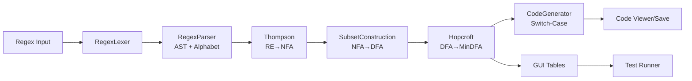
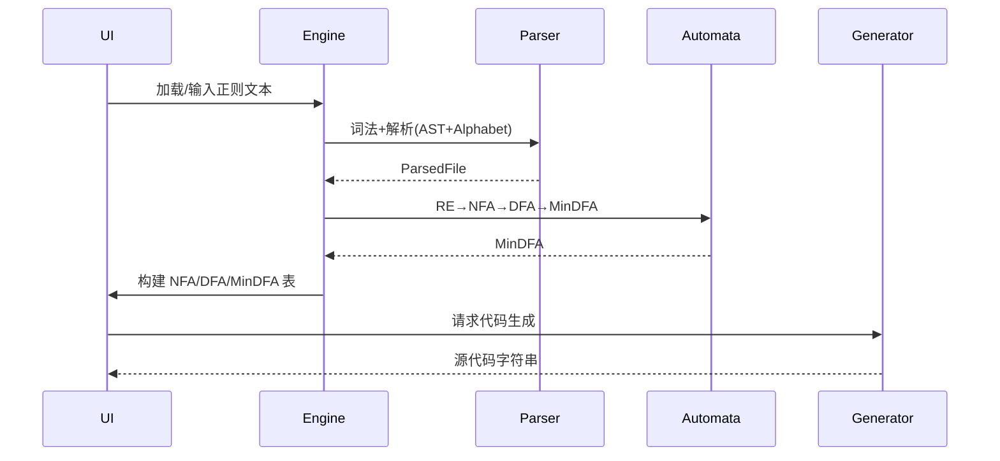
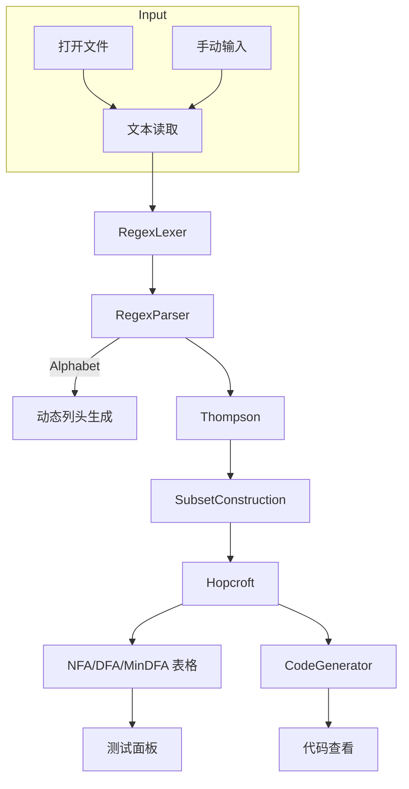
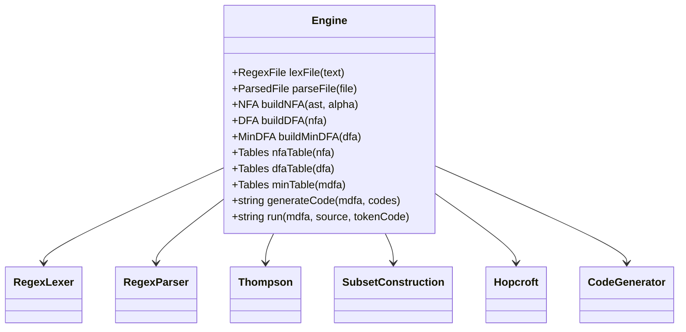

# byyl 词法分析生成器

- 环境：macOS，Qt 6.9.3，CMake 4.2.0，Ninja 1.13.2
- 构建：`qt-cmake -S . -B build-macos -G Ninja`，`cmake --build build-macos -j`
- 运行：`open build-macos/byyl.app` 或 `build-macos/byyl.app/Contents/MacOS/byyl`
- 测试：`ctest --test-dir build-macos -V`

## 使用
- 在“正则编辑”Tab 输入或打开正则（示例：`resources/tiny.regex`、`tests/regex/python.regex`、`tests/regex/javascript.regex`）
- 点击“从文件加载”选择正则文件，随后点击“转换”查看 NFA/DFA/MinDFA 三个表格（列头动态包含字母表与 `#`）
- 点击“生成代码”在“代码查看”Tab 查看生成的 C/C++ 源代码（方法二：Switch-Case 状态机）
- 在“测试与验证”Tab 输入源（示例：`resources/sample.tny`），点击“运行词法分析”生成编码序列

## 项目架构

### 模块划分
- `app/` GUI 层：主窗口与 Tabs、文件加载、状态提示
  - 控件 objectName：`txtInputRegex`、`btnLoadRegex`、`btnStartConvert`、`tblNFA`、`tblDFA`、`tblMinDFA`、`txtGeneratedCode`、`txtSourceTiny`、`txtLexResult`、`btnGenCode`、`btnRunLexer`
- `core/` 核心逻辑（与 GUI 解耦，可单测）
  - `regex/`：词法与解析，生成 AST 与字母表
  - `automata/`：Thompson、子集构造、Hopcroft
  - `generator/`：将 MinDFA 生成 C/C++ 源代码（方法二）
  - `model/`：状态、边、字母表与转移结构体
  - `Engine`：统一流程编排与表格构建、运行器
- `tests/`：
  - `auto_test_ui.cpp`：Qt Test UI 自动化
  - `regex/python.regex`、`regex/javascript.regex`：语言基本语法的正则集合
- `resources/`：示例 `tiny.regex` 与 `sample.tny`

### 关系与数据流
- 输入文本（宏定义 + Token 规则）→ 词法切分与头部解析（识别 `_nameNNN`、`_nameNNNS`）
- 解析生成 AST（Concat/Union/Star/Plus/Question/CharSet/Symbol/Ref）并提取字母表（含 `letter`、`digit` 等集合）
- Thompson 构造 NFA（支持 `#` ε 转移）→ 子集构造生成 DFA（状态集合命名 `{1,4,7}`）→ Hopcroft 最小化并重新编号
- 生成代码（Switch-Case）与 GUI 表格展示（首列标记 `-`/`+`，第二列状态/集合，后续列为字母表与 `#`）
- 测试运行器按 MinDFA 扫描源，跳过空白与 `{...}` 注释，输出编码序列

## 构建与运行
- 配置：`qt-cmake -S . -B build-macos -G Ninja`
- 编译：`cmake --build build-macos -j`
- 运行：`open build-macos/byyl.app` 或 `build-macos/byyl.app/Contents/MacOS/byyl`
- 测试：`ctest --test-dir build-macos -V`

## 设计与规范
- 正则文件格式：宏 `name=expr`；Token `_nameNNN=...`、组 `_nameNNNS=x|y|z...`
- 日志：建议启用 `export QT_LOGGING_RULES="*.debug=true"`
- 跨平台：路径用 `QDir/QFileInfo`；文件读写用 `QTextStream`；布局使用 `QLayout`；编码 UTF-8

## 示例
- Python/JS 正则：`tests/regex/python.regex`、`tests/regex/javascript.regex`
- TINY：`resources/tiny.regex`、`resources/sample.tny`

## 测试与示例（通俗易懂版）

### GUI 快速测试
- 启动应用：`open build-macos/byyl.app`
- 加载正则：在“正则编辑”页点击“从文件加载”，选择 `resources/tiny.regex`（或 `tests/regex/python.regex`/`javascript.regex`）
- 点击“转换”：下方三个表会显示 NFA、DFA、MinDFA 的状态转移（列头会根据正则中的字母表自动增加，`#` 表示 ε）
- 点击“生成代码”：在“代码查看”页能看到按 Switch-Case 状态机生成的 C/C++ 源码
- 运行示例：切到“测试与验证”页，左侧输入源文本，例如：
  - `read x\nwrite y123`（TINY 片段）
  - `abc123`（用于测试标识符）
  然后点击“运行词法分析”，右侧会显示编码序列（识别到的 Token 编码数字）

提示：初次上手建议使用只包含一个 Token 规则的正则（比如 `_ID101 = letter(letter|digit)*`），这样更容易看出识别效果；包含多条 Token 规则的“并行扫描器”版本会在后续增强中提供。

### 命令行测试（与 GUI 一致的管线）
- 一键构建并运行测试：
  - `cmake --build build-macos -j`
  - `ctest --test-dir build-macos -V`
- 会看到两个测试用例：
  - `GuiTest`：基础 UI 自动化，验证关键控件存在
  - `CliRegexTest`：命令行管线测试（lex→parse→NFA→DFA→MinDFA→run），打印三阶段表的列数和扫描输出
- 样例输出（不同正则与平台略有差异，仅作参考）：
  - `NFA cols=40`
  - `DFA cols=39`
  - `MinDFA cols=39`
  - `OUT=...`（扫描得到的编码序列；当当前规则不匹配时会有 `ERR`）

### 手动运行代码生成器（思路演示）
- 在 GUI 中点击“生成代码”后，复制“代码查看”里的内容到本地文件 `lex.cpp`
- 用任意 C++ 编译器编译：例如 `clang++ lex.cpp -o tiny_lexer`
- 准备输入文件（比如 `sample.tny`），运行生成的扫描器，输出结果到命令行或文件

### 常见问题
- 找不到 Qt：优先使用 `qt-cmake`，或为普通 `cmake` 添加 `-DCMAKE_PREFIX_PATH=/opt/homebrew/opt/qt`
- 表格无内容：检查是否加载了有效的正则，建议先试用单规则（如标识符）再逐步扩展
- 命令行输出为 `ERR`：当前版本一次只针对单条 Token 规则构建自动机；如果文本与该规则不匹配会显示 `ERR`。要看到编码输出，请选择与输入相符的规则（例如标识符或数字）
